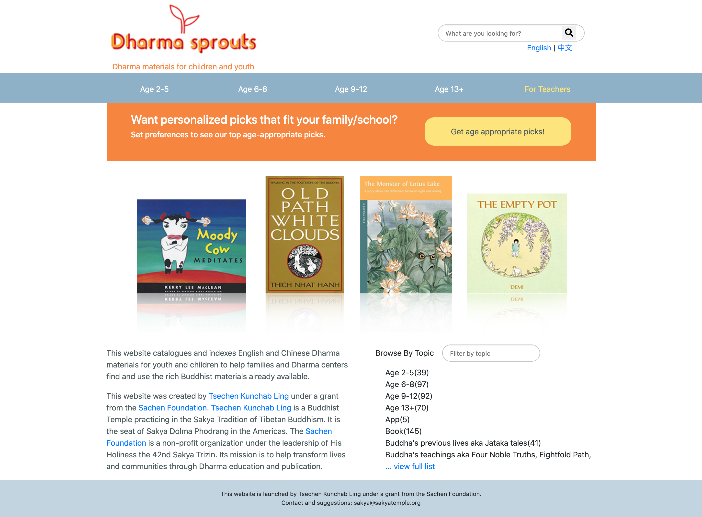
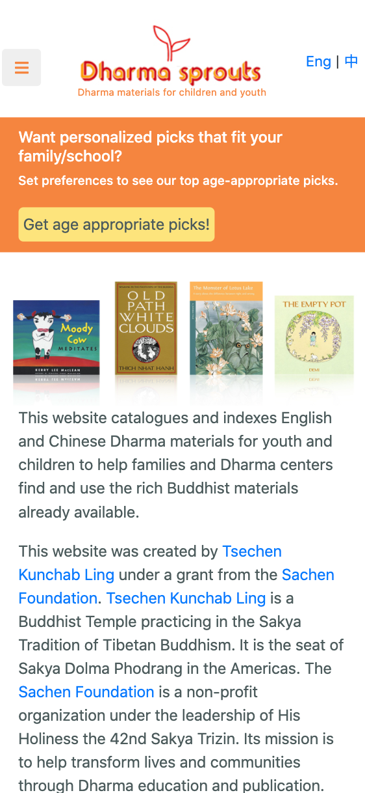

# dharmasprouts.org

The primary goal of **[DharmaSprouts](http://dharmasprouts.org/)**  was to build an aggregate website that catalogues and indexes English and Chinese Dharma materials for youth and children to help families and Dharma centers find and use the rich Buddhist materials already available. 
The website allows parents and teachers to search for materials by age, by topic, or by language. Curriculum materials are also included. 

(desktop screen)
 
(responsive on smaller screens)

* Designed and styled responsive site using Bootstrap and CSS, including customized logo and images. 
* Developed algorithm recommending dharma materials based on the user’s input data.
* Utilized GoogleAnalytics and GoogleSearchConsole to track website traffic.

This is a volunteer project that I did for [Tsechen Kunchab Ling]{https://sakyatemple.org/}. 
